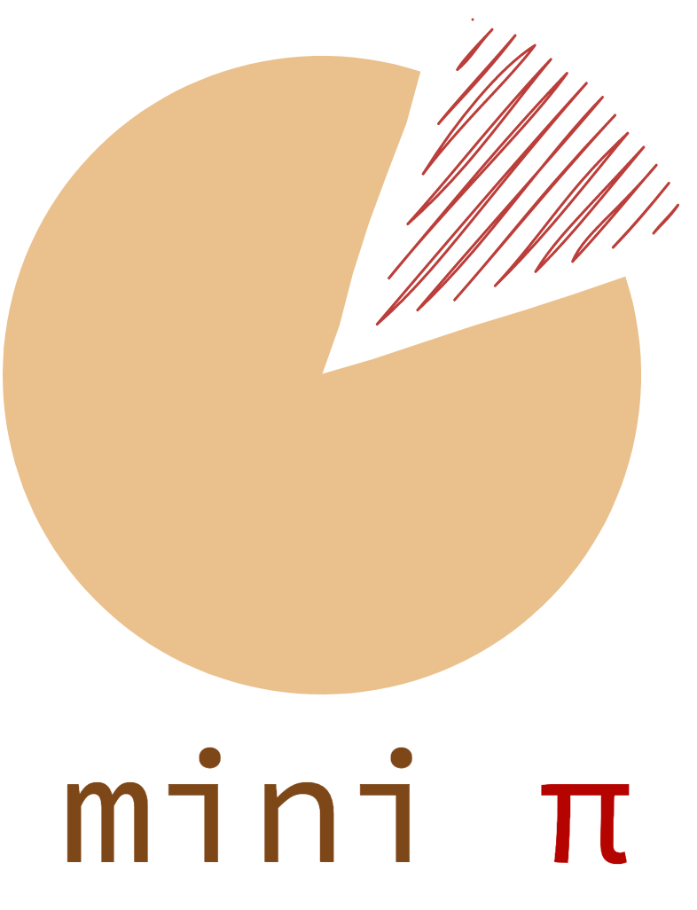

Status: In progress

<p align="center">
  
</p>

<h1 style="text-align: center;">MiniPi: A Minimalist RL Library</h1>

<!-- badges -->
[](https://opensource.org/licenses/MIT)
[](https://www.python.org)
[](https://pytorch.org)
[](https://github.com/psf/black)


## 📦 Installation

```bash
# Clone the project
git clone git@github.com:kaixin96/minipi.git

# Create conda env and install dependencies
conda env create -f environment.yml
activate minipi

# Install minipi
pip install -e .
```

## Usage

See test examples